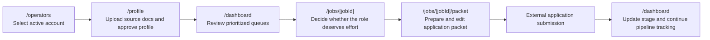

# Route and User Flow Map

## End-to-End Product Flow

## Route Responsibility Map

| Route | User goal | True responsibility | Must show | Must not own |
| --- | --- | --- | --- | --- |
| `/operators` | Choose the active account for this browser session. | Account selection and first-account creation for the internal tool. | Existing accounts, active selection, simple account creation. | Profile editing, job data, migration/setup instructions in the steady-state product. |
| `/dashboard` | Decide what to review, save, prepare, or ignore next. | Queue command center for discovery, prioritization, and pipeline tracking. | Queue views, next-action rail, counts, shortlist/dismiss controls, clear stage meaning. | Canonical profile editing, full packet editing, deep source-document review. |
| `/profile` | Upload source materials, review extracted facts, and set ranking preferences. | Canonical profile workspace for source documents, user facts, matching preferences, and public links. | Source documents, generated draft review, profile facts, matching preferences, public links. | Queue management, job-specific tailoring, packet-specific outputs. |
| `/jobs/[jobId]` | Decide whether the role deserves application effort. | Job review page for fit explanation, risk evaluation, and next action. | Job summary, fit reasons, red flags, score breakdown, save/dismiss/prepare action. | Full application editing, profile editing, long-form packet authoring. |
| `/jobs/[jobId]/packet` | Turn the selected job into submission-ready materials. | Application packet editing and readiness page. | Resume delta, cover letter, portfolio recommendation, answers, final status actions. | Canonical profile editing, ranking logic explanation beyond a brief recap. |

## Route-Level Findings

| Priority | Finding | Why it matters | Recommendation | Impact | Effort | Owner |
| --- | --- | --- | --- | --- | --- | --- |
| `P1` | `/operators` mixes user-facing account selection with internal setup/error language. | Private users should not see infra-oriented messages as part of the normal account flow. | Keep the page focused on account choice and account creation; move migration/setup recovery copy into admin-only help or internal diagnostics. | `user clarity` | `small` | `product` |
| `P1` | `/dashboard` labels do not cleanly match the workflow model. | `Saved`, `Prepared`, and `Applied` are meaningful to the user, but the underlying statuses are `shortlisted`, `preparing`, `ready_to_apply`, `follow_up_due`, and `interview`. | Define queue labels as user-facing views only, and map them from one explicit workflow model. | `system consistency` | `medium` | `shared` |
| `P1` | `/profile` currently owns intake, canonical review, matching preferences, and public-link management in one dense surface. | The route is correct, but the mental model is still easy to blur. | Keep the single route, but formalize four strata: `Source documents`, `Profile facts`, `Matching preferences`, and `Public links and portfolio`. | `user clarity` | `medium` | `product` |
| `P1` | `/jobs/[jobId]` and `/jobs/[jobId]/packet` are conceptually different pages but currently share the same main loader and page shell. | Decision-mode and execution-mode should feel like different tasks. | Create separate view models and page narratives even if some sections stay shared. | `system consistency` | `medium` | `shared` |
| `P2` | Root routing is clear, but the product currently relies on users understanding that the dashboard is the hub and profile is a prerequisite. | That dependency is correct but should feel intentional. | Keep `/dashboard` as the hub, but tighten copy and empty/locked states so the route hierarchy is obvious. | `user clarity` | `small` | `product` |

## Canonical Route Rules

### `/operators`

- Purpose: select the active account for the session.
- Should read as a lightweight selector, not as a product setup wizard.

### `/dashboard`

- Purpose: triage and pipeline management.
- Every queue action should answer: `review`, `save`, `prepare`, `mark applied`, or `archive`.

### `/profile`

- Purpose: create and maintain the one source of truth that powers matching and generation.
- The route should distinguish facts from preferences everywhere.

### `/jobs/[jobId]`

- Purpose: decide whether to spend effort.
- This page is for evaluation, not for full editing.

### `/jobs/[jobId]/packet`

- Purpose: finalize application materials.
- This page is for editing and readiness, not for deep fit analysis.
