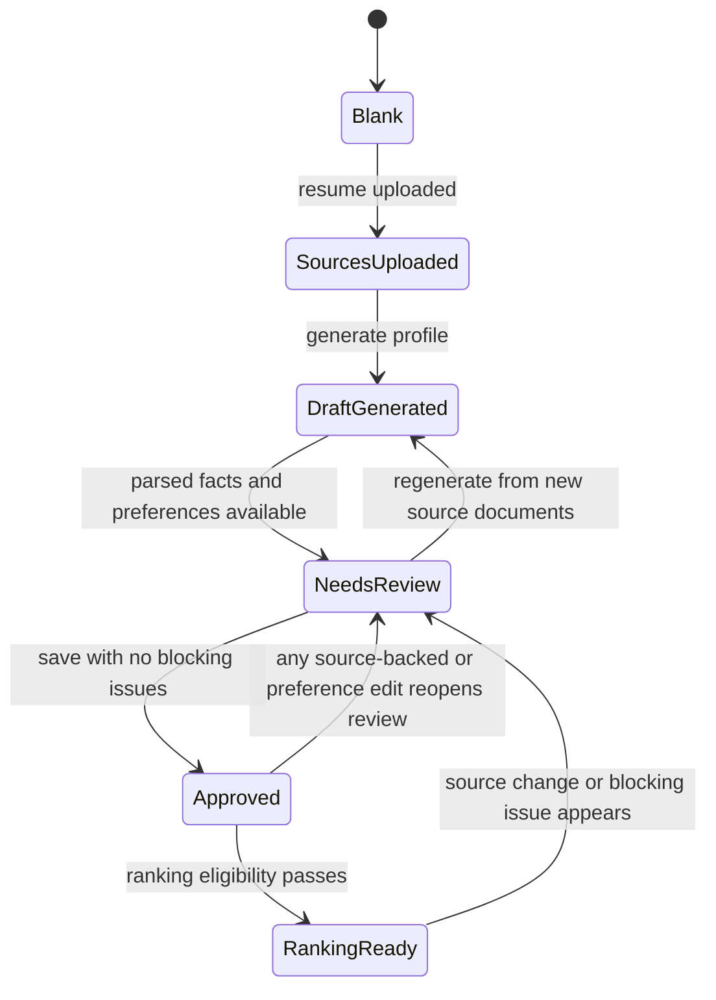
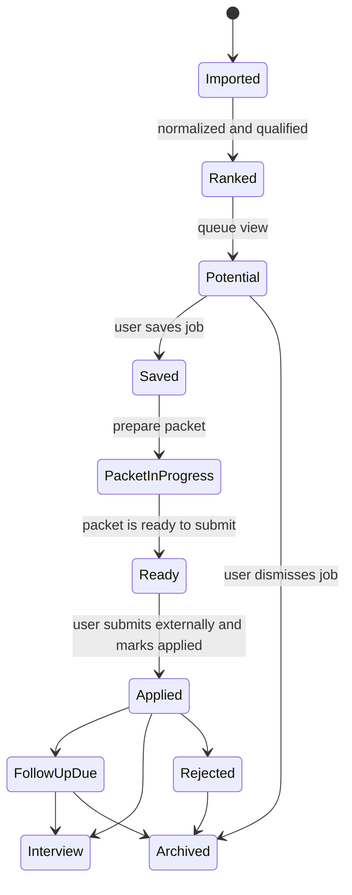

# Logic and State Machine Audit

## Current Logic Layers

| Layer | What belongs here | Current evidence |
| --- | --- | --- |
| Persisted source of truth | Account, profile facts, source documents, portfolio items, jobs, workflow status, packet records | `user_profiles`, `resume_master`, `cover_letter_master`, `portfolio_items`, ranked jobs, packet records |
| Derived operational state | Queue segment, queue score, fit explanations, readiness checks, ranking lock, market ordering | `dashboard-queue.ts`, `qualification`, `learning`, issue collectors, readiness helpers |
| Generated artifacts | Resume variants, cover letters, answers, summaries, rendered markdown | `lib/ai/tasks/*`, packet builders, master markdown renderers |
| Temporary UI state | Open tab, overlay placement, save flash, review indicator visibility, inline editing state | `ProfileSaveMessageRootProvider`, `TagInput`, `OverlayOptionField`, packet/profile client forms |

## Current-State Risks

| Priority | Finding | Why it matters | Recommendation | Impact | Effort | Owner |
| --- | --- | --- | --- | --- | --- | --- |
| `P0` | Ranking unlock is implicit and spread across `hasSourceMaterial`, `approvalStatus`, `canonicalProfileReviewedAt`, and issue collectors. | The most important gate in the product is not modeled as one explicit state. | Introduce one explicit `ProfileReadinessState` and one explicit `RankingEligibilityState`. | `logic integrity` | `medium` | `shared` |
| `P1` | Queue behavior combines persisted `workflowStatus` with derived `queueSegment`, `queueScore`, and route-level queue views. | Users experience queues, but the system currently reasons through multiple overlapping models. | Treat queue views as derived presentations of one canonical job workflow model plus packet state. | `system consistency` | `medium` | `shared` |
| `P1` | The `Saved` queue is backed by `shortlisted` and `preparing`, while `Prepared` is backed by `ready_to_apply`. | User-facing queue meaning and stored job states are not aligned. | Formalize a user-facing queue map and keep internal statuses hidden unless intentionally surfaced. | `user clarity` | `small` | `product` |
| `P1` | `/jobs/[jobId]` and `/jobs/[jobId]/packet` both load the same packet review data and render the same main page component. | Decision mode and execution mode are not first-class in the app model. | Split into separate view models: `JobReviewViewModel` and `ApplicationPacketViewModel`. | `system consistency` | `medium` | `shared` |
| `P1` | The profile server action currently parses form data, resolves uploads, calls AI, normalizes records, persists data, and revalidates routes in one place. | This makes the highest-risk flow hard to reason about and hard to test in isolation. | Split into parsing, domain composition, generation orchestration, persistence, and route invalidation layers. | `maintainability` | `large` | `backend` |
| `P1` | `master-assets.ts` handles normalization, cleanup, confidence, issue collection, and markdown rendering in one large module. | It has become both a domain normalizer and a policy engine. | Split into `normalize`, `validate`, `render`, and `state-derivation` modules. | `maintainability` | `large` | `shared` |
| `P1` | Fallback modes differ semantically: blank onboarding fallback, seeded jobs, database fallback, and real database-backed flow. | Local and production truth can diverge in subtle ways. | Model environment mode explicitly and normalize the UI behavior around it. | `logic integrity` | `medium` | `shared` |
| `P1` | Overlay list fields are custom controls without a fully explicit keyboard and selection state model. | This is both an accessibility and a maintainability risk. | Define one shared accessibility contract for overlay lists, including arrow keys, focus movement, and selected-option semantics. | `accessibility` | `medium` | `frontend` |
| `P2` | AI tasks are already separated by file, but route/action layers still assemble too much task-specific shape. | The modularity is good, but the contracts are not yet strict enough. | Push more input shaping into dedicated view-model builders so AI tasks stay pure. | `maintainability` | `medium` | `backend` |

## Target Profile and Ranking State Machine

### Notes

- Cover letter readiness is optional and parallel.
- Ranking should depend on one explicit eligibility state, not on several hidden booleans.

## Target Job and Packet State Machine

### Notes

- `Potential`, `Saved`, `Ready`, `Applied`, and `Archived` are queue views.
- `PacketInProgress` and generation states should remain packet states, not top-level queue nouns.

## Responsibility Map

| Layer | Should own | Should not own |
| --- | --- | --- |
| Data loaders | Route-specific view models assembled from persisted data and derived read models | Business-rule mutation, AI prompt shaping, raw form parsing |
| Server actions | Authentication/context, validated command handling, persistence orchestration, route invalidation | Deep normalization policy, rendering policy, UI-only state decisions |
| Domain normalizers | Clean and validate structured data, derive issue lists, render deterministic markdown | Database calls, route invalidation, UI copy |
| AI tasks | Structured transformations from clearly defined inputs to clearly defined outputs | Persistence, user-facing workflow gating, environment fallback behavior |
| UI components | Presentation and temporary interaction state | Domain truth, readiness policy, environment mode decisions |

## Target Contract Definitions

### Profile

- `ProfileSourceState`: `blank | sources_uploaded | draft_generated`
- `ProfileReadinessState`: `needs_review | approved`
- `RankingEligibilityState`: `locked | ready`

### Job

- `JobWorkflowState`: `potential | saved | ready | applied | archived`
- `PacketState`: `not_started | in_progress | ready | sent`

### Rule

Queue views should be derived from canonical workflow state plus packet state. They should not invent a second independent state system.
